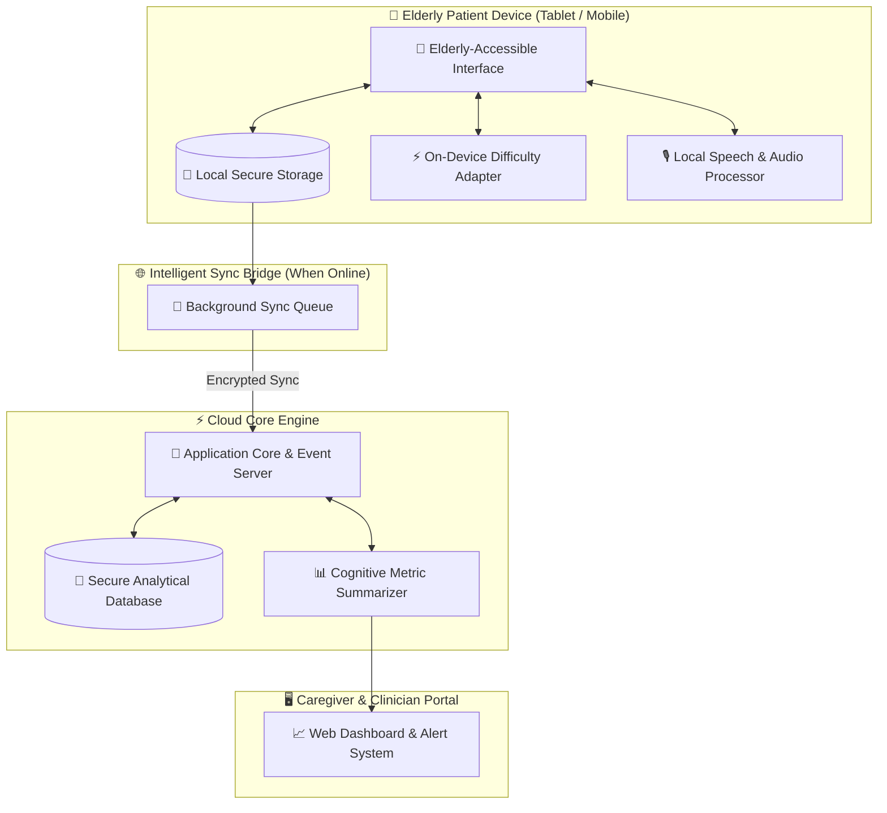

[README.md](https://github.com/user-attachments/files/31430605/README.md)
<div align="center">

# ⚡ ℙ 𝕊 𝕆 𝕁 𝔼 ℂ 𝕋 - 𝕏 ⚡
### *The Next-Gen AI Cognitive & Memory Assistance Platform*

[](https://github.com/)
[](https://github.com/)
[](https://github.com/)
[](https://github.com/)

---

### 🌸 *“Restoring dignity and vitality to elderly minds through adaptive AI and cultural resonance.”* 🌸

*An AI-Powered, Offline-First Cognitive Gaming & Memory Assistance Platform tailored for Elderly Dementia Patients in India’s North Eastern Region (NER).*

---

</div>

<br/>

## 🌌 ✦ THE DIVINE MISSION

In the misty hills, serene river valleys, and remote villages of India’s North Eastern Region (NER), millions of elderly seniors suffer from **dementia and age-related cognitive decline**. Separated by challenging geography, limited connectivity, and scarcity of specialized memory clinics, these elders face confusion, anxiety, and social isolation.

**PROJECT-X** is engineered as an empowering digital sanctuary. By fusing **adaptive artificial intelligence** with **hyper-localized NER heritage** (Bihu dance patterns, Muga silk weaves, tea garden landscapes, local folklore), **PROJECT-X** transforms cognitive stimulation therapy into an engaging, accessible, and comforting daily habit.

---

## ✨ ✦ THE 4 HEAVENLY PILLARS

```
                     ╔═════════════════════════════════════════╗
                     ║               PROJECT-X                 ║
                     ║       AI Cognitive Gaming Engine        ║
                     ╚═════════════════════════════════════════╝
                                          ║
         ┌──────────────────┬─────────────┴─────────────┬──────────────────┐
         ▼                  ▼                           ▼                  ▼
  🧠 Adaptive AI     🌺 Cultural Immersion      🎙️ Voice & Dialect     🛡️ Guardian Loop
  Dynamic difficulty  Bihu, Muga Silk, Tea     Assamese, Manipuri,    Caregiver metrics
   calibrates skill   Garden visual motifs     Mizo, Hindi & English    & offline sync
```

### 1. 🧠 **Adaptive Edge-AI Engine**
*Zero frustration. Zero anxiety. Pure engagement.*
Our adaptive intelligence engine continuously tracks reaction times, interaction accuracy, and hesitation patterns in real-time. If an elderly patient struggles, the system seamlessly and invisibly adjusts difficulty downward to preserve dignity, self-esteem, and emotional calm.

### 2. 🌺 **Hyper-Localized NER Cultural Immersion**
Generic Western brain training games fail Indian seniors. **PROJECT-X** immerses elders in deeply nostalgic context:
- **Festival Recall:** Remember sequences of Bihu dance instruments & Assam tea garden blooms.
- **Textile Matching:** Match intricate Muga Silk weaves and traditional Manipuri patterns.
- **Proverb & Lore Match:** Reconnect with time-honored regional proverbs and native folklore.

### 3. 🎙️ **Voice-First Local Language Interface**
Designed for seniors with motor tremors, visual impairment, or low tech literacy. Supports natural voice interaction in regional languages (**Assamese, Manipuri, Mizo, Bengali, Hindi, English**), allowing elders to simply speak to their screen.

### 4. 🛡️ **Offline-First Caregiver Guardian Loop**
Engineered for hilly, low-connectivity terrains. The patient application functions **100% offline** using local encrypted data storage. When network connectivity is available, session metrics silently synchronize with the Caregiver Portal, providing families and healthcare workers with actionable cognitive trend insights and anomaly alerts.

---

## 🏛️ ✦ SYSTEM ARCHITECTURE



---

## 🎨 ✦ DESIGN SYSTEM & ELDERLY ACCESSIBILITY

Designed with deep gerontological empathy. Every pixel is crafted for 75+ seniors experiencing visual or motor limitations:

| Design Element | Specification | Rationale |
|---|---|---|
| **Primary Palette** | `#2E7D32` (Forest Green) • `#FF8F00` (Warm Amber) | Calming, natural NER tones that reduce anxiety |
| **Background** | `#FFF8E1` (Warm Cream) | Soft on aging eyes; eliminates harsh white glare |
| **Typography** | Accessible Sans (18px - 32px Bold) | Native script support (Assamese, Meitei, Devanagari) |
| **Touch Targets** | Massive 48x48 dp minimum | Accommodates tremors and joint stiffness |
| **Feedback** | Gentle chimes + soft haptics | Zero punitive sounds or stressful "Game Over" alerts |

---

## 👥 ✦ THE GUARDIANS OF PROJECT-X

<div align="center">

| Guardian | Role | Strategic Focus | Presentation Ownership |
|---|---|---|---|
| 👑 **Vikas** | **Team Leader & Architecture** | Project Coordination, Module Breakdown, Dependency & System Plan | **Intro & System Architecture** |
| 🔍 **Sahil** | **Research & User Impact** | Domain Research, User Pain Points, Competitor Analysis & Evidence | **Problem & Target Users** |
| 🎭 **Soumya** | **Demo & Presentation** | Pitch Structure, Main Demo Flow Ownership & Judge Q&A Prep | **Killer Feature & Live Demo** |
| 🎨 **Yamini** | **UX/UI & Product Experience** | Elderly UX, High-Contrast Design, Accessibility & Visual Quality | **Elderly Experience & UX** |
| ⚡ **Bharat** | **Technical & Product Lead** | Product Execution, AI/ML Adaptation Engine, Component Integration & Quality | **Technology & AI Mechanics** |

</div>

---

## 🚀 ✦ SYSTEM WORKFLOW GUIDE

### 1. Initialize the Workspace
```bash
git clone https://github.com/your-username/PROJECT-X.git
cd PROJECT-X
```

### 2. Launch Client Interface
```bash
cd app
npm install
npm start
```

### 3. Launch System Server Core
```bash
cd backend
python -m venv venv
# On Windows:
.\venv\Scripts\activate
pip install -r requirements.txt
python main.py
```

---

## 🌌 ✦ THE HACKATHON OS STRUCTURE

This repository is governed by the **8-File Hackathon OS**:

```
d:\PROJECT-X\hackathon-os\
├── 00_MASTER_STATE.md                ← Single Source of Truth & Live Status
├── 01_PROBLEM_RESEARCH_COMPETITION.md ← Deep Domain Research & Competitor Matrix
├── 02_PRODUCT_PRD.md                 ← Functional PRD, MVP & Roadmap
├── 03_AI_DOMAIN_STRATEGY.md          ← Cognitive Science, CST & AI Adaptation Engine
├── 04_TECH_ARCHITECTURE.md            ← System Architecture, API Contracts & Schemas
├── 05_UX_UI_DEMO.md                  ← Design Tokens, Screen Specs & Demo Script
├── 06_EXECUTION_PITCH_JUDGING.md      ← War Room, Task Matrix & Pitch Slides
└── 07_EVIDENCE_DECISIONS_KNOWLEDGE.md← Memory Layer, Decision Logs & Evidence
```

---

<div align="center">

### 🌸 *Restoring Dignity. Reconnecting Heritage. Empowering Elders.* 🌸

Crafted with ❤️ by **Team Project-X** for **MDoNER Hackathon (PS ID: 26003)**

[⭐ Star this Repo](https://github.com/) • [📖 Read Hackathon OS](hackathon-os/00_MASTER_STATE.md) • [💬 Contact Team](mailto:team@projectx.in)

</div>
